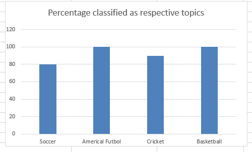

# Will Naive Bayes Classification results match Topic Inference (by Latent Dirichlet Allocation) results?

## Overview
In this experiment I put together four categories of news articles - 'soccer', 'Americal footbal', 'cricket' and 'basketball'. With Naive Bayes, I wrote a classifier that when applied to test data sets (10 articles for each classes), generates following result:

### Percentage of correctly classified test samples:

</a>

I then thought if topic modeling by Latent Dirichlet Allocation could identify four classess above as four topics. When K=4 was set as number of topics in the same training sample, following was the topic-word distribution:

</a>

I have an INTUITION that first topic resembles 'basketball', second topic resembles 'soccer', third topic resembles  'cricket' and fourth topic is like 'Americal futbol'. 
### ANY COMMENTS?

I then inferred topics for test samples (same 10 samples per class used in Naive Bayes). I checked to see if all the test samples will be inferred to have topics that match naive bayes classification results i.e. will 10 samples from each sports class be inferred as having respective topics? Following is the result:

</a>

## Please feel free to write at pandey.datatech@gmail.com
