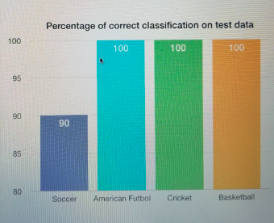
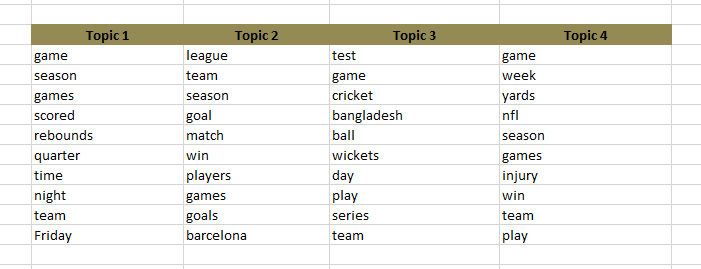

# An Experiment with two Generative Models: Naive Bayes and Latent Dirichlet Allocation

## Overview
In this experiment I put together four categories of news articles - 'soccer', 'Americal footbal', 'cricket' and 'basketball'. With Naive Bayes, I wrote a classifier that when applied to test data sets (10 articles for each classes), generates following result:

### Percentage of correctly classified test samples:

</a>

I then thought if topic modeling by Latent Dirichlet Allocation could identify four classess above as four topics. When K=4 was set as number of topics in the same training sample, following was the topic-word distribution:

</a>

I have an INTUITION that first topic resembles 'basketball', second topic resembles 'soccer', third topic resembles  'cricket' and fourth topic is like 'Americal futbol'. 
### DO YOU AGREE?

I then inferred topics for test samples (same 10 samples per class used in Naive Bayes). I checked to see if 10 test samples from cricket will be inferred as having topic 3. And similarly, 10 samples from each sports class will be inferred as having respective topics. Following is the result:

